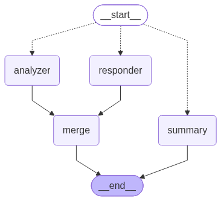

# English AI Tutor

A conversational agent that holds a natural dialogue in English while correcting
the learner's mistakes — without letting the corrections take over the
conversation.

Two concerns run in parallel and never mix:

- **responder** plays a conversation partner. It never mentions mistakes, keeps
  vocabulary at the learner's CEFR level, and always ends with a question.
- **analyzer** looks only at the learner's last message and returns structured
  corrections. It never produces conversational text.

A merge node assembles the turn — reply first, corrections second — and applies
**severity gating**: every `critical` correction is shown, at most one `minor`
per turn, and `style` findings are held back for the end-of-session report.
Over-correcting makes learners stop talking, so how much is surfaced is decided
in Python, not asked of the model.



`responder` and `analyzer` are two independent LLM calls issued concurrently;
`summary` is a separate entry point taken when the session ends, so no reply is
generated for a turn the learner never wrote.

## Quickstart

```bash
uv sync
cp .env.example .env      # set TUTOR_PROVIDER and the provider's API key
uv run chainlit run app.py
```

Set your CEFR level in the chat settings — it changes both prompts, not just the
wording. Send `/summary` to end the session and get the report.

## Voice input

Press the mic and speak. The recording is transcribed **locally** with
faster-whisper — no API key, no per-minute cost, and the audio never leaves the
machine — and comes back as a draft:

> 🎙 **Draft:** I go to Rome yesterday with my sister
> _Send it, or type a corrected version._ **[Send] [Discard]**

Nothing reaches the tutor until you press **Send**, so you always see what was
recognised first. Typing anything discards the draft, so a stale one can never
be sent by surprise.

Chainlit offers no way to prefill the message composer, which is why the draft
is a message with buttons rather than editable text in the input box. To edit,
type the corrected version — the draft steps aside.

```bash
make asr    # download the model up front; otherwise the first dictation waits for it
```

`TUTOR_ASR_MODEL` picks the size (`tiny` … `large-v3-turbo`, default `small`).
On an M-series Mac, `small` transcribes ~4 s of speech in under two seconds and
is accurate enough for learner speech; move up to `medium` if your learners have
strong accents and you can spend the latency. `TUTOR_ASR_SAMPLE_RATE` must match
`sample_rate` under `[features.audio]` in `.chainlit/config.toml`.

## Providers

The provider is chosen with `TUTOR_PROVIDER`; `src/tutor/llm.py` is the only
file that knows about any of them.

| `TUTOR_PROVIDER` | Models | Credentials |
|---|---|---|
| `anthropic` | `claude-opus-5`, `claude-sonnet-5`, … | `ANTHROPIC_API_KEY` |
| `openai` | `gpt-…` | `OPENAI_API_KEY` |
| `ollama` | anything local, e.g. `qwen2.5:14b` | none; set `TUTOR_OLLAMA_BASE_URL` |

Models are configured per role (`TUTOR_RESPONDER_MODEL`, `TUTOR_ANALYZER_MODEL`,
`TUTOR_SUMMARY_MODEL`), so the analyzer — where precision matters — can run on a
stronger model than the conversation partner.

Temperature is set explicitly per role (analyzer `0`, responder `0.7`, summary
`0.2`). Claude models from Opus 4.7 onward reject sampling parameters outright,
so for those the factory omits temperature and the analyzer's determinism comes
from the prompt instead.

### Local models

Small local models are noticeably weaker at structured output and at *not*
inventing errors — see the eval numbers below. Nothing in the code papers over
this: a schema violation propagates instead of being swallowed. A 14B-class
instruct model is the practical floor for the analyzer.

## Cost

Token counts and cost are collected per turn by a callback and printed under
every reply. Anthropic list prices ship in `src/tutor/pricing.py`; for any other
model, supply prices via `TUTOR_PRICING_FILE` (JSON:
`{"<model id>": {"input": <usd per 1M>, "output": <usd per 1M>}}`). An unpriced
model logs a warning and still reports tokens — cost is never silently absent.

## Persistence

State is checkpointed to SQLite (`TUTOR_CHECKPOINT_DB`), keyed by the Chainlit
thread id. Verified across a process restart: the conversation, the CEFR level
and the accumulated corrections are restored from the checkpointer, not from
process memory.

## Evals

`evals/dataset.jsonl` holds labelled sentences per CEFR level, including
**correct sentences as negative controls**. False positives are the failure mode
that matters — an analyzer that invents errors in a correct sentence is worse
than one that misses some — so the false-positive rate is reported separately
from the per-type scores.

```bash
uv run python evals/run.py --concurrency 4
```

Latest run — `qwen2.5:7b-instruct-q4_K_M` via Ollama, 2026-08-30, 35 examples,
cost: n/a (local model):

| error type | P | R | F0.5 | support |
|---|---|---|---|---|
| agreement | 0.50 | 0.50 | 0.50 | 2 |
| article | 0.00 | 0.00 | 0.00 | 1 |
| aspect | 0.00 | 0.00 | 0.00 | 0 |
| grammar | 0.33 | 0.17 | 0.28 | 6 |
| preposition | 1.00 | 0.75 | 0.94 | 4 |
| tense | 0.50 | 0.71 | 0.53 | 7 |
| vocabulary | 0.00 | 0.00 | 0.00 | 1 |
| word_order | 0.50 | 1.00 | 0.56 | 1 |

False-positive rate on correct sentences: **0.08**.

This is a small local model on a small dataset — it is a baseline, not a
capability claim. Re-run and replace this table whenever the analyzer prompt or
model changes; stale numbers are worse than none.

## Commands

`make help` lists them; each target is a one-line `uv run …` if you prefer to
run it directly.

| | |
|---|---|
| `make install` | `uv sync` |
| `make run` | Chainlit UI |
| `make test` | test suite, no network |
| `make lint` / `make format` | ruff |
| `make typecheck` | mypy strict |
| `make check` | lint + types + tests + format check — what CI runs |
| `make evals` | eval suite (calls a real model) |
| `make graph` | regenerate `docs/graph.png` |
| `make asr` | pre-download the speech-recognition model |
| `make clean` | caches and the local session database |

## Layout

```
src/tutor/
    graph.py       StateGraph assembly, checkpointer, diagram
    state.py       TutorState and its reducers
    models.py      Pydantic models — Correction, SessionSummary, …
    severity.py    the gating rule
    llm.py         model factory, the only provider-aware module
    pricing.py     token prices
    callbacks.py   per-turn usage accounting
    config.py      pydantic-settings
    asr.py         local speech recognition for voice input
    prompts/       prompts as .md, loaded at import
    nodes/         responder, analyzer, merge, summary
```
